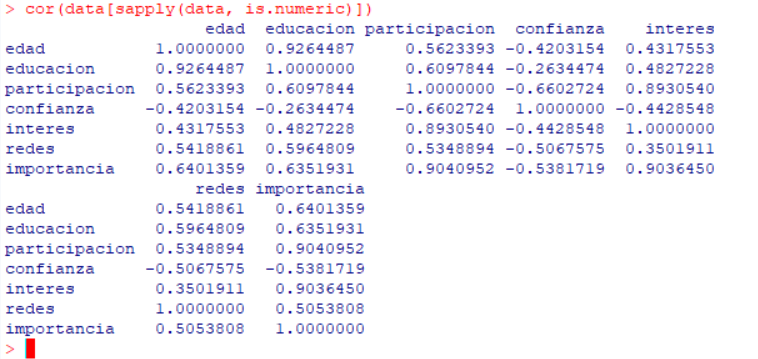
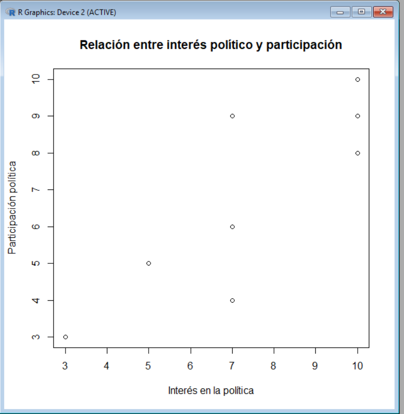

# Análisis de la Participación Política en Jóvenes

## Descripción
Este proyecto tiene como objetivo analizar la relación entre la participación política en jóvenes y diversos factores que pueden influir en ella, como la confianza en las instituciones, el interés en la política, el uso de redes sociales, la edad y el nivel educativo.

## Encuesta
El formulario utilizado para la recolección de datos se puede consultar aquí:

[Ver encuesta](https://docs.google.com/forms/d/e/1FAIpQLSf-acAorwl_vgOLcGBD5oSxXMTD_7YZvK-30N5ogs28nWGzvA/viewform)

## Base de datos
Los datos fueron obtenidos a través de una encuesta aplicada a jóvenes. El conjunto de datos incluye variables como participación política, interés, confianza, uso de redes sociales, edad y nivel educativo.

[Descargar base de datos](Respuestas de formulario.csv)

## Metodología
Se diseñó y aplicó una encuesta con preguntas en formato cuantitativo, lo que permitió realizar un análisis estadístico en R.

## Matriz de correlación

La matriz de correlación muestra una fuerte relación positiva entre el interés y la participación, así como entre la importancia y la participación. En contraste, la confianza presenta una relación negativa.

## Gráfica de dispersión

La gráfica muestra una relación positiva entre el interés en la política y la participación política, lo que indica que a mayor interés, mayor participación.

## Regresión lineal

Se estimó un modelo de regresión lineal con los siguientes resultados:

- R² = 0.94
- Modelo estadísticamente significativo (p < 0.001)

**Interpretación:**
El interés y la educación tienen un efecto positivo significativo sobre la participación política, mientras que la confianza presenta una relación negativa. Las redes sociales no muestran un efecto significativo.

## Código en R

El código completo utilizado para el análisis se encuentra disponible en el siguiente archivo:

[Ver código en R](Análisis_político.R)

## Conclusión

Los resultados indican que el interés político es el factor más importante para explicar la participación política. Este ejercicio demuestra la utilidad de herramientas cuantitativas como la correlación y la regresión lineal para analizar fenómenos sociales.

